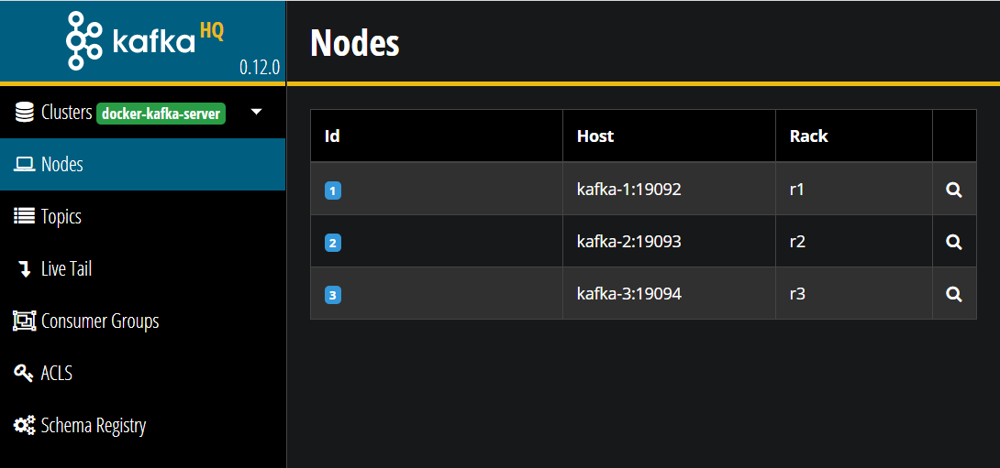
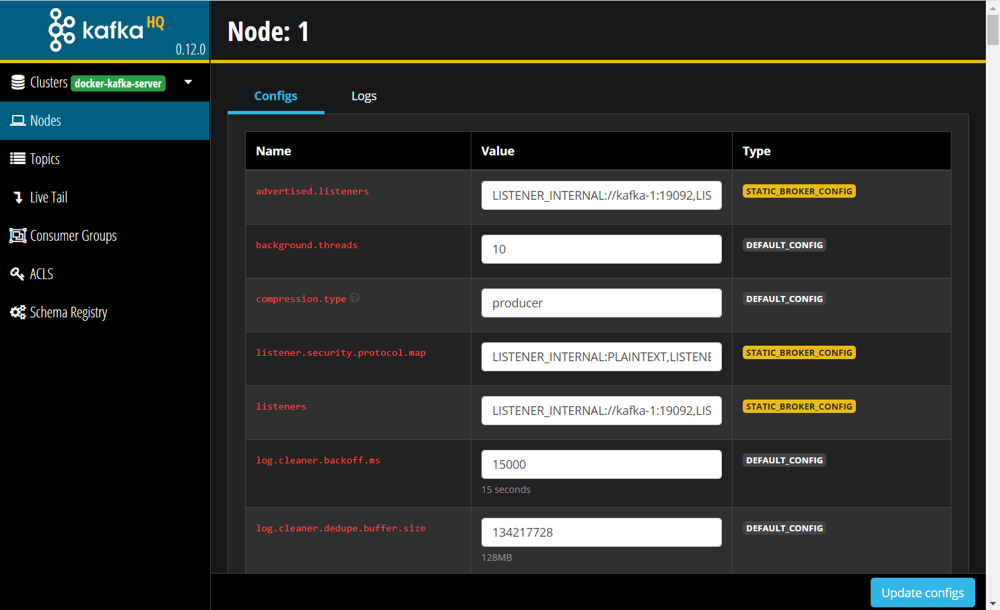

# Getting started with Apache Kafka

In this first lab, you will have your first look and feel around Apache Kafka, using the environment that you have prepared prior to the workshop using [the instructions on the environment](../environment/readme.md).

The main units of interest in Kafka are topics and messages. A topic is simply what you publish a message to, topics are a stream of messages.

In this workshop you will learn how to create topics, how to produce messages, how to consume messages and how to describe/view metadata in Apache Kafka. 

Note: I gratefully made use of Guido Schmutz's https://github.com/gschmutz/stream-processing-workshop/tree/master/02-working-with-kafka-broker when compiling these instructions; Guido is a long time expert on messaging and streaming and he has published many articles, presentations and workshop documents
    
## Working with built-in Command Line Utilities 
If you currently do not have the Apache Kafka environment up and running, then start it as this point. Run this command on the command line on your Docker host in the directory that contains the *docker-compose.yml* file.

`docker-compose up -d`

### Connect to a Kafka Broker 
The environment contains of a Kafka cluster with 3 brokers, all running on a single, non-distributed Docker host. So it's of course not meant to be really fault-tolerant but to demonstrate how to work with a Kafka cluster. 

To work with Kafka you need the command line utilities. They are available on each broker. 
The `kafka-topics` utility is used to create, alter, describe, and delete topics. The `kafka-console-producer` and `kafka-console-consumer` can be used to produce/consume messages to/from a Kafka topic. 

So let's connect into one of the broker through a terminal window. 

Open a terminal window on the Docker Host and run a `docker exec` command to start a shell in the `kafka-1` docker container 

```
docker exec -ti kafka-1 bash
```

if we just execute the `kafka-topics` command without any options, a help page is shown

```
root@kafka-1:/# kafka-topics
Create, delete, describe, or change a topic.
Option                                   Description
------                                   -----------
--alter                                  Alter the number of partitions,
                                           replica assignment, and/or
                                           configuration for the topic.
--bootstrap-server <String: server to    REQUIRED: The Kafka server to connect
  connect to>                              to. In case of providing this, a
                                           direct Zookeeper connection won't be
                                           required.
...
```

### List topics in Kafka

First, let's list the topics available on your Kafka Cluster. For that we use the `kafka-topics` utility with the `--list` option. 

```
kafka-topics --list --zookeeper zookeeper-1:2181
```

We can see that there are no topics yet, apart from an internal (__confluent) topic.  

### Creating a topic in Kafka

Now let's create a new topic. For that we again use the **kafka-topics** utility but this time with the `--create` option. We will create a test topic with 6 partitions and replicated 2 times. The `--if-not-exists` option is handy to avoid errors, if a topic already exists. 

```
kafka-topics --create --if-not-exists --zookeeper zookeeper-1:2181 --topic test-topic --partitions 6 --replication-factor 2
```

Re-Run the command to list the topics.
```
kafka-topics --list --zookeeper zookeeper-1:2181
```
You should see the new topic you have just created. 

### Describe a Topic

You can use the `--describe` option to get details on a specific topic, such as the distribution of the partitions over the cluster nodes (aka brokers).

```
kafka-topics --describe --zookeeper zookeeper-1:2181 --topic test-topic
```
The output will look similar to this one - but will most likely not be exactly the same because the distribution of partitions over brokers is dynamic.
```
Topic:test-topic	PartitionCount:6	ReplicationFactor:2	Configs:
	Topic: test-topic	Partition: 0	Leader: 3	Replicas: 3,2	Isr: 3,2
	Topic: test-topic	Partition: 1	Leader: 1	Replicas: 1,3	Isr: 1,3
	Topic: test-topic	Partition: 2	Leader: 2	Replicas: 2,1	Isr: 2,1
	Topic: test-topic	Partition: 3	Leader: 3	Replicas: 3,1	Isr: 3,1
	Topic: test-topic	Partition: 4	Leader: 1	Replicas: 1,2	Isr: 1,2
	Topic: test-topic	Partition: 5	Leader: 2	Replicas: 2,3	Isr: 2,3
```

### Produce and Consume to Kafka topic with command line utility

Now let's see the topic in use. The most basic way to test it is through the command line. Kafka comes with two handy utilities `kafka-console-consumer` and `kafka-console-producer` to consume and produce messages through the command line. 

First let's run the consumer on the topic `test-topic` we have created before

```
kafka-console-consumer --bootstrap-server kafka-1:19092,kafka-2:19093 --topic test-topic
```
After it is started, the consumer just waits for newly produced messages. 

Open a new terminal window, and again connect into container `kafka-1` using a `docker exec` command 

```
docker exec -ti kafka-1 bash
```

Now run the following command to start the producer.   
 
```
kafka-console-producer --broker-list kafka-1:19092,kafka-2:19093 --topic test-topic
```

The console producer utility reads from *stdin*, and takes a broker list instead of a zookeeper address. We specify 2 of the 3 brokers of the Streaming Platform.

On the `>` prompt enter a few messages, execute each single message by hitting the **Enter** key.<br>
**Hint:** Try to enter them as quick as possible.

```
>aaa
>bbb
>ccc
>ddd
>eee
```

You should see the messages being consumed by the consumer in the first terminal window where you started the *kafka-console-consumer*. 

```
root@kafka-1:/# kafka-console-consumer --bootstrap-server kafka-1:19092,kafka-2:19093 --topic test-topic
aaa
bbb
ccc
eee
ddd
```

You may see that they don't arrive in the same order as produced (if you are entering them fast enough on the producer side). The consumer reads from multiple partitions. The producer produces to multiple partitions. The processing of messages through the partitions to the consumer happens in parallel. That is why a message published later than another message and to a different partition (and processed on a different broker) can arrive earlier at the consumer. 

You can stop the consumer by hitting **Ctrl-C**. If you want to consume from the beginning of the log, use the `--from-beginning` option.

```
kafka-console-consumer --bootstrap-server kafka-1:19092,kafka-2:19093 -topic test-topic --from-beginning
```
You can also echo a longer message and pipe it into the console producer, as it is reading the next message from the command line:

```
echo "This is my first message!" | kafka-console-producer --broker-list kafka-1:19092,kafka-2:19093 --topic test-topic
```

And of course you can send messages inside a bash for loop:

```
for i in 1 2 3 4 5 6 7 8 9 10
do
   echo "This is message $i"| kafka-console-producer --broker-list kafka-1:19092,kafka-2:19093 --topic test-topic --batch-size 1 &
done 
```

By ending the command in the loop with an & character, we run each command in the background and all loop iterations therefore in parallel. 

If you check the consumer, you can see that the messages are not received in the same order as they were sent, because of the different partitions, and the messages being published in multiple partitions. We can force order by using a key when publishing the messages and always using the same value for the key; the consequence of using the same key for these messages is that all messages are assigned to same partition. Messages are strictly ordered within partitions - but not across partitions. 

### Working with Keyed Messages

A message produced to Kafka always consists of a *key* and a *value*. The *value* is mandatory and represents the message/event's *payload*. If a *key* is not specified, such as we did so far, then it is passed as a null value and Kafka distributes such key-less messages in a round-robin fashion over the different partitions. 

We can check that by re-consuming the messages we have created so far, specifying the option `--from-beginning` together with the option `print.key` and `key.separator` in the console consumer. For that stop the still running consumer (`ctrl+C`)and restart it again using the following command. Note the `from-beginning` switch that instructs the consumer to read all messages on the topic - not just the new ones but including and starting with the full message history. This is one of the distinguishing features that Apache Kafka introduced to the world of messaging: the message queue is long lived instead of very volatile (read once).

```
kafka-console-consumer --bootstrap-server kafka-1:19092,kafka-2:19093 --topic test-topic --property print.key=true --property key.separator=, --from-beginning
```

We can see that the keys are all `null` because so far we have only created the value part of the messages.

For producing messages also with a key, use the options `parse.key` and `key.separator`. 

```
kafka-console-producer --broker-list kafka-1:19092,kafka-2:19093 --topic test-topic --property parse.key=true --property key.separator=,
```

Enter your messages so that a key and messages are separated by a comma, i.e. `key1,value1`.  Do that for a few messages and check that they are shown in the console consumers as key and value. 


## Using Apache Kafka HQ

[Apache Kafka HQ](https://akhq.io/) is an open source tool for managing a Kafka cluster: a GUI for Apache Kafka® to manage topics, topics data, consumers group, schema registry, connect and more...It has been started as part of the **Kafka platform ** and can be reached on <http://kafka:28042/> (provided you added the IP address to the *hosts* file associated with the host name *kafka*, and otherwise at http://192.168.188.110:28042/ or http://127.0.0.1:28042/.

The first page in AKHQ shows an overview of the cluster and its nodes. Note: the connection from AKHQ to the Kafka platform is defined in docker-compose.yml, that is where the name for the cluster ("docker-kafka-server") stems from.
 
You can inspect the details for each node - through the looking glass icon or just by clicking on the row for the node. This reveals the configuration settings for the node as well as an overview of the logs managed on the node/by the broker.
 

The Topics page shows the topics currently created on the entire Kafka Cluster. You will see the *test-topic* that you have just created through the Kafka Console utility. If you show all topics, you will also see one or more internal topics, used by Kafka for housekeeping. The *__consumer_offsets* topic keeps track of the *read offset* for all consumers (or rather: for all consumer groups).

 

You can see the number of messages on the *test-topic* as well as the number of partitions and the replication factor. You can downdrill on the topic, to level of the actual messages in the message log:

You should see the messages that you have just been producing through the Kafka Console. You can see the message's production time and offset, their size, key and contents and the partition to which they have been assigned. You cannot change any of these properties - the message log is immutable.

Other tabs in AKHQ for the topic provide access to the partitions (and their current offset), Consumer Groups consuming from the topic, the configuration, ACLs (Access Control Lists) and the message logs themselves. 

### Produce a message
Click on the button *Produce to Topic*. A window opens where you can define the message to produce. You only need to enter a message text. Then press Produce.


You will see an indication that the message has been produced to the topic. 


Now check in the Kafka Console terminal window where the Kafka Consumer is running. You will see your own message, produced from the AKHQ application to the *test-topic*. Note: this Kafka Console Consumer session has been associated with an auto-generated Consumer Group (console-consumer-<generated number>). When you stop and start the console consumer, you will continue to consume from the previous offset reached in the console - unless you specify the *from-beginning* switch. 

The message is also visible in AKHQ if you inspect the details for the *test-topic*. Note: the message may not have the highest offset of them all. The offset is defined per partition - so the offset value for your message depends on the previous offset in the specific partition selected by the Kafka Cluster for the message.


When you produce a message in the Kafka Console, that message will of course show up in the GUI of AKHQ as well.


# Resources
A nice introductory article on Apache Kafka: [Part 1: Apache Kafka for beginners - What is Apache Kafka?](https://www.cloudkarafka.com/blog/2016-11-30-part1-kafka-for-beginners-what-is-apache-kafka.html)


